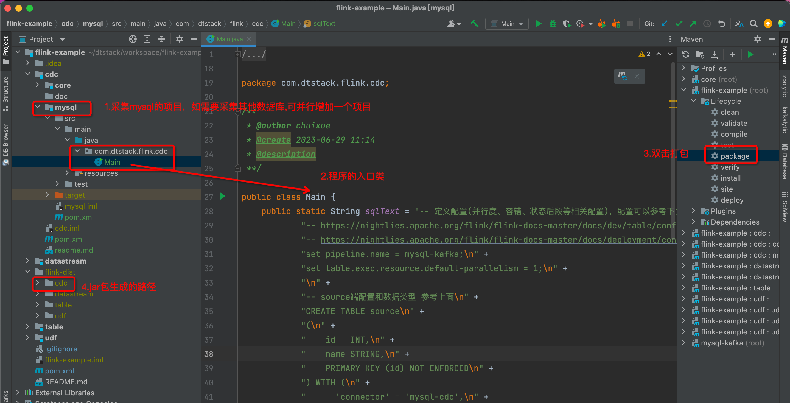
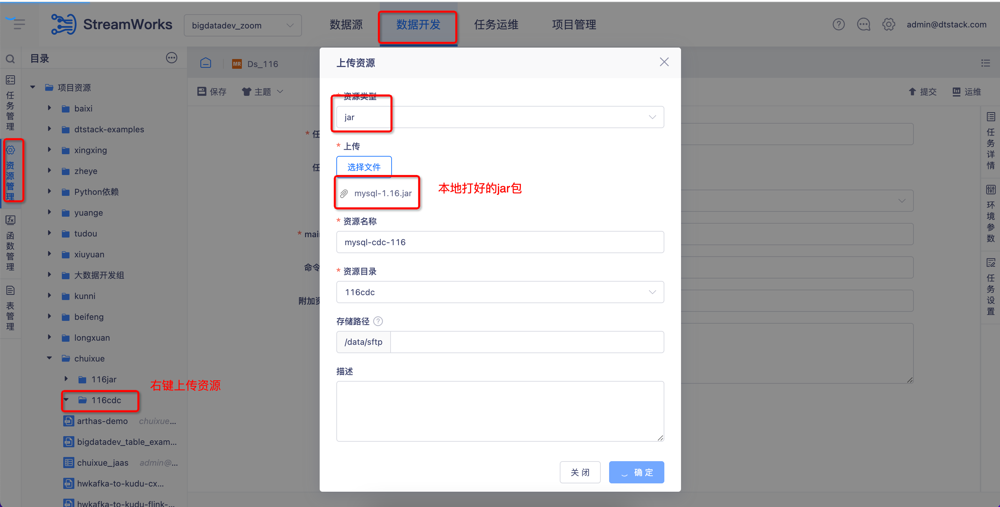
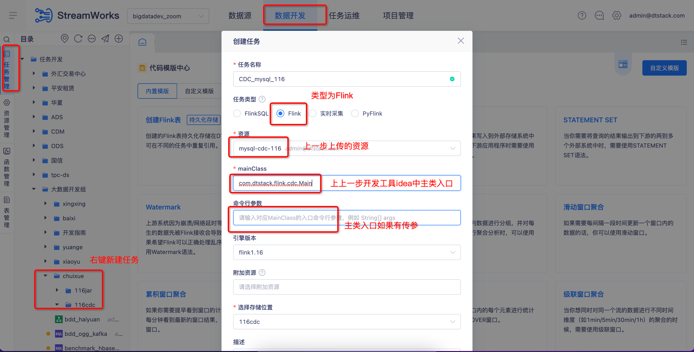

# 基于apache flink和flink-cdc-connectors工程的采集案例

该工程的目的是可以通过sql化的方式，方便的全量、增量一体化采集mysql、oracle等数据库中的数据，而不用安装其他的一些类canal、ogg等采集工具.
目前数栈flink版本和flink-cdc版本(flink:1.16.1 ，flink-cdc:2.4.0)，该工程打包后，可在数栈上使用.
```
flink官方文档：https://nightlies.apache.org/flink/flink-docs-master/release-notes/flink-1.16/

flink-cdc官方文档：https://ververica.github.io/flink-cdc-connectors/master/
```

## 使用步骤
### sql开发&工程打包


### 平台使用

