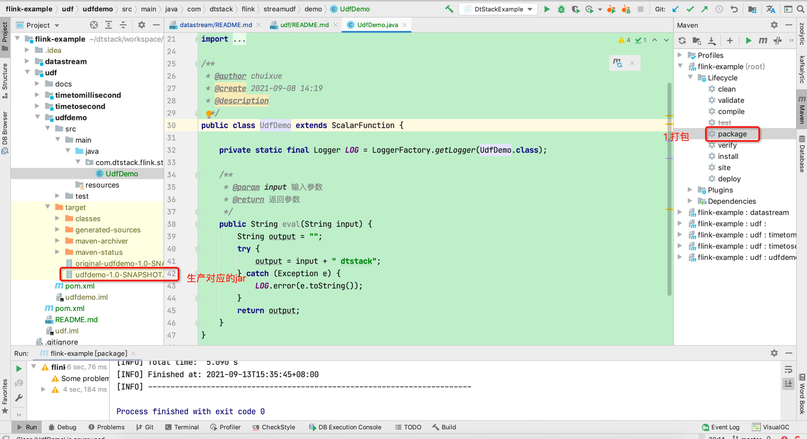
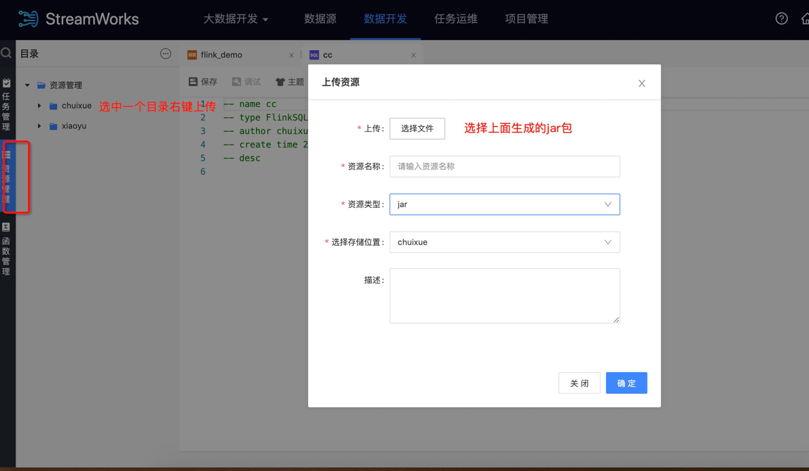
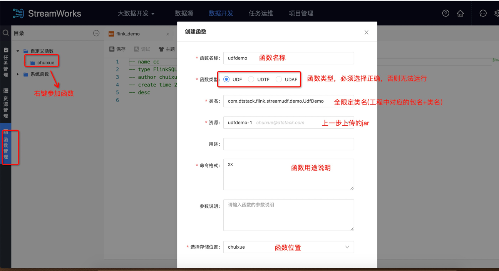
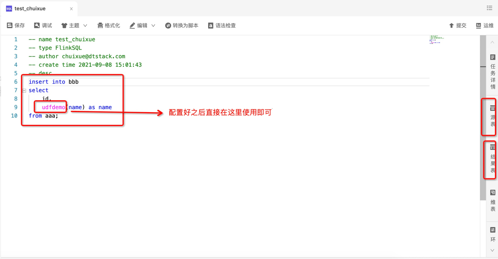
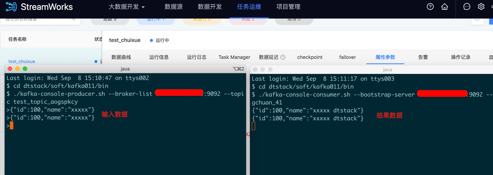

# udf
> 在flink基础上自定义一些常用的函数

### 1.数栈如何是UDF
#### 1.将工程打包
 
#### 2.上传jar包

#### 3.创建函数

#### 4.使用函数

#### 5.结果验证


### 2.一些数栈开发内置的udf
#### 1.增加毫秒级与秒级时间戳精度UDF

```
CREATE scala FUNCTION timeToSecondUdf WITH com.dtstack.flink.streamudf.udf.TimeToSecondUdf;
CREATE scala FUNCTION timeToMilliSecondUdf WITH com.dtstack.flink.streamudf.udf.TimeToMilliSecondUdf;

CREATE TABLE MyTable(
    a varchar, -- 2018-05-29 13:52:50
    b varchar, -- 2018-05-29 13:52:50 123
    timeToSecondUdf(a,'yyyy-MM-dd HH:mm:ss') AS d,
    timeToMilliSecondUdf(b,'yyyy-MM-dd HH:mm:ss SSS') AS e
 )WITH(
    ...
 );
```

